## 1. Introduction

Imagine, you would like to provision resources in Azure using Terraform, but you don't have the tools, respectively the prerequisites installed on your local machine?
A dev container, including all the mandatory stuff could help for that purpose.

In this post I'd like to show you how I'm using my dev container to:
  * apply *Azure* CLI commands (login, updating a *kubeconfig* file)
  * use *vim* for editing files
  * use *git* for cloning a repository from *GitHub*
  * apply *Terraform* commands for provisioning an *Azure* *Kubernetes* Service
  * apply *kubectl* commands

## 2. Prerequisites

As prerequisites you'll need:

  * a Container Runtime Environment like *Docker*: https://www.docker.com/products/docker-desktop/
  * Visual Studio Code: https://code.visualstudio.com/
  * Docker Extension for Visual Studio Code: https://marketplace.visualstudio.com/items?itemName=ms-azuretools.vscode-docker)

## 3. Build and Run the Dev Container

I've created a Container, which is based on Ubuntu 22.04 and which has following tools installed:

  * curl
  * terraform
  * vim
  * git
  * azure cli
  * kubectl


### 3.1 Build the Container with a Terminal

``` powershell
docker build -t devcon-terraformonazure:1.0 . 
``` 

### 3.2 Run the Container

``` powershell
docker run -it devcon-terraformonazure:1.0 
``` 

## 4. Usage of the Dev Container with Visual Studio Code

### 4.1 Run the Container using Visual Studio Code

As first step, start Visual Studio Code:


Select the "Docker" icon on the left and scroll to the "devcon-terraformonazure" image. Right click at the tag and choose "Run Interactive":

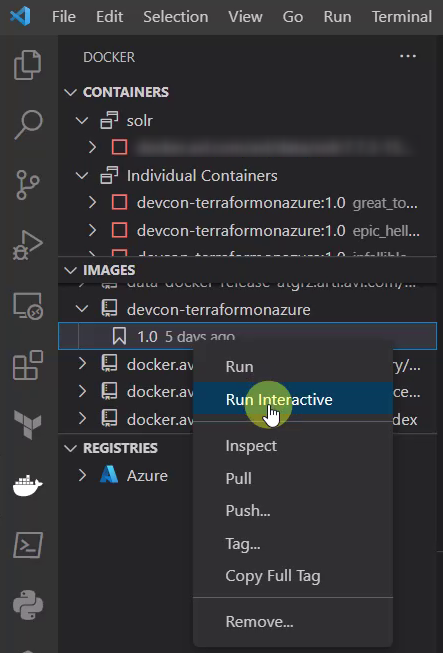

A new terminal occurs, showing the run command for the Container:

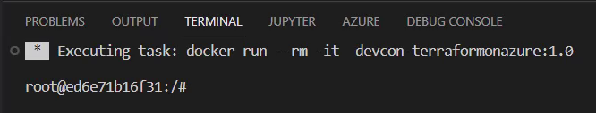

As next, go to "Containers", there the running instance should be listed. Right click on the running instance and choose "Attach Visual Studio Code":

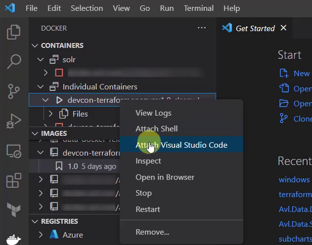

A new Visual Studio Code instance will be started:

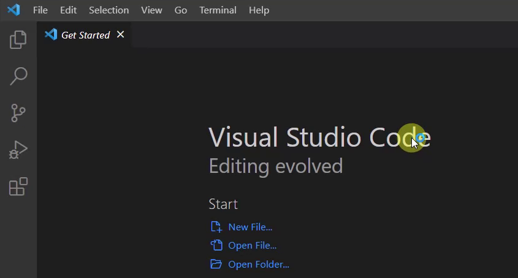

You should be capable to prove that you're now connected to the Container:

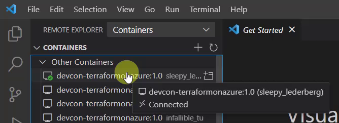

You can list the content of the current directory of the Container - this should be similar as seen in the picture below:

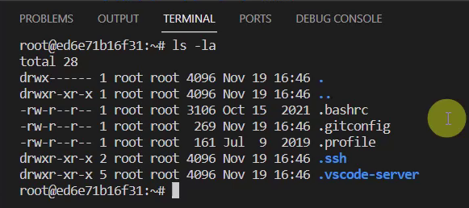

Now the Container is ready, let's do some actions with the mentioned tools.

### 4.2 Azure CLI - Login to your Azure Subscription

Prove that the *Azure* CLI is installed by simply typing "az" in the Terminal:

![alt text](pictures/08_az_01.png" alt="08_az_01" width="500px">}}

Let's establish the connection to an *Azure* subscription. For that, I'd like to use the "azure login" command. Therefore, type:

``` powershell
az login
``` 

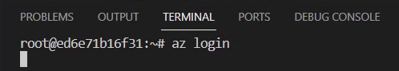

Confirming the command by pressing enter opens your browser. 
Select your dedicated account, which you'd like to use:


After picking you account, you should see logs similar as seen in the picture below:

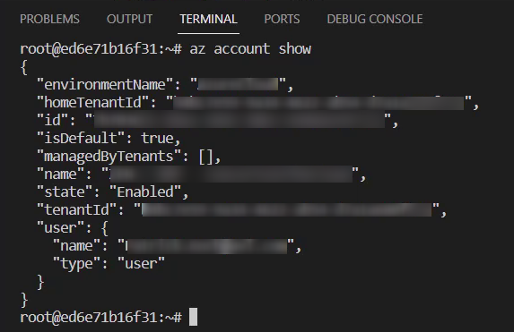

### 4.3 Git - Clone a GitHub Repository

After conducting the login to the *Azure* subscription, I'll need some code to work with.
For that, I'm going to clone a *GitHub* repository.

For instance, I'll go to https://github.com/patkoch/iac_terraform_azure - copy the web url for the *git clone* command:


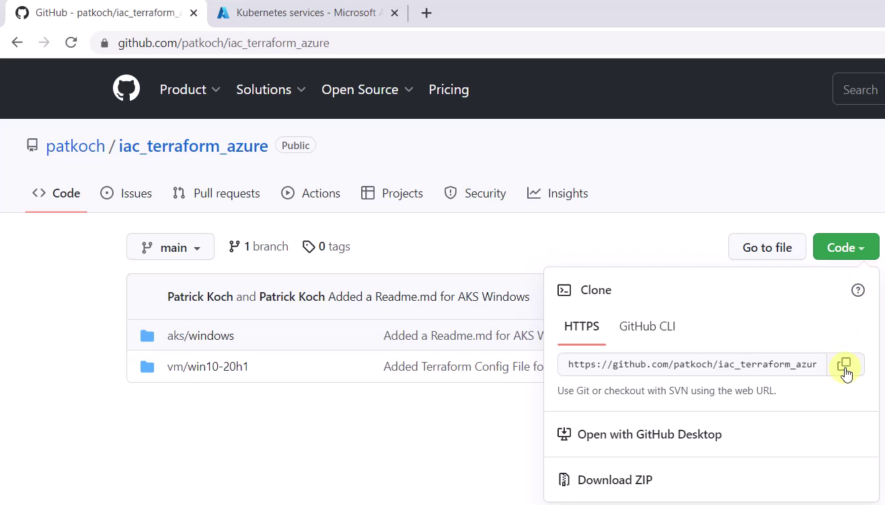

Switch back to Visual Studio Code and clone the repository by pasting the command in the Terminal:

``` powershell
git clone https://github.com/patkoch/iac_terraform_azure.git
``` 
Conducting that command should clone the whole repository in the dev container. The directory "iac_terraform_azure" will be available in the file system:

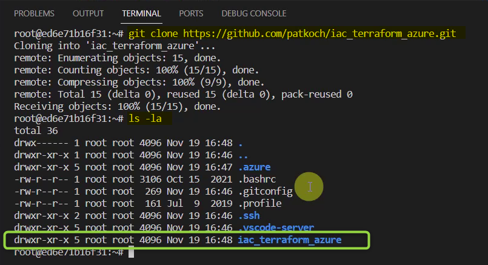

Change the directory to "/iac_terraform_azure/aks/windows)

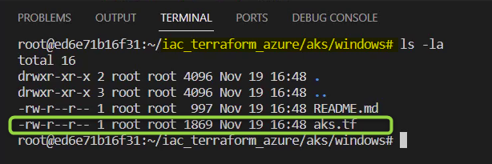